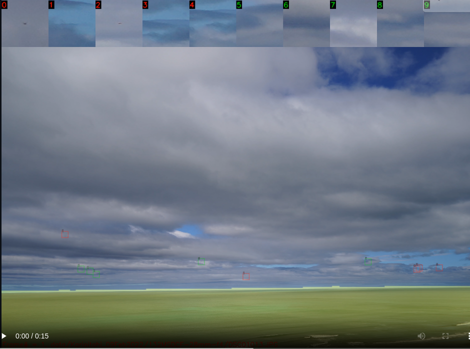

# MauiTracker
Tracking of small objects in video frames

<p align="center">
  
</p>

### Installation

Download MauiTracker from github and create a virtual environment

- Half pi tested on python 3.8

``` sh
mkdir repos
cd repos
git clone https://github.com/johnnewto/MauiTracker.git
cd MauiTracker
python -m venv 'venv'
source ./venv/bin/activate
pip install --upgrade pip
pip install -e .
```

 
### Usage

``` sh
python main.py
```

Recording
``` sh
python main.py -h
usage: main.py [-h] [-r]

Tracking of small objects in video frames

optional arguments:
  -h, --help    show this help message and exit
  -r, --record  Enable recording
```

Runs small object detections on a small image [data set](https://github.com/johnnewto/MauiTracker/tree/main/data/Karioitahi_09Feb2022/132MSDCF-28mm-f4)

- [Main branch](https://github.com/johnnewto/MauiTracker/tree/main) just runs detections with no tracking
- [Tag With tracker](https://github.com/johnnewto/MauiTracker/releases/tag/With-tracker)
loads and classified the detections using a porrly trained [pytorch classification model](https://github.com/johnnewto/MauiTracker/blob/main/data/model.pth)
The confidence of the detections is shown as the third digit in the tile bar.
It uses a SORT MOT tracking algorithim

With one of the windows in focus press spacebar to step, g to go continuously, d to change direction and q to quit

<video width="1280" height="720"  controls>
  <source src="https://raw.githack.com/johnnewto/MauiTracker/main/data/Karioitahi_09Feb2022/132MSDCF-28mm-f4.mp4" type="video/mp4">
  This might show in github
</video>


[](https://raw.githack.com/johnnewto/MauiTracker/main/video.html)

Note: using  https://raw.githack.com/ to serve both mp4 and html